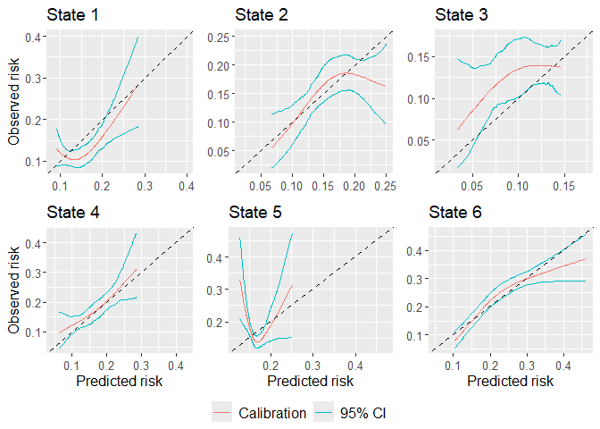

<!-- README.md is generated from README.Rmd. Please edit that file -->

# calibmsm

<!-- badges: start -->

[](https://github.com/alexpate30/calibmsm/actions/workflows/R-CMD-check.yaml)
[](https://app.codecov.io/gh/alexpate30/calibmsm/?branch=master)
<!-- badges: end -->

The goal of calibmsm is to provide a set of tools for producing
calibration plots for validating an existing (i.e. previously developed)
multistate model.

## Installation

You can install the development version of calibmsm from
[GitHub](https://github.com/) with:

``` r
# install.packages("devtools")
devtools::install_github("alexpate30/calibmsm")
```

## Example

This is a basic example which shows you how to assess the calibration of
the transition probabilities at 5 years follow up for individuals out of
state `j` at time `s`. The predicted transition probabilities are stored
in `tps0`, the individuals data are stored in `ebmtcal`, and the data is
`msdata` format are stored in `msebmtcal`. Calibration curves are
estimated using `calc_calib_blr`. Inverse probability of censoring
weights are calculated based on variables year, age, prophylaxis and
donor gender match. The calibration curves are estimated using
restricted cubic splines. A 95% confidence interval is calculated using
bootstrapping with 200 bootstrap replicates.

``` r
## Load calibmsm
library(calibmsm)

## Extract relevant predicted risks from tps0
tp.pred <- dplyr::select(dplyr::filter(tps0, j == 1), any_of(paste("pstate", 1:6, sep = "")))

## Calculate observed event probabilities
dat.calib.blr <-
  calc_calib_blr(data.mstate = msebmtcal,
                 data.raw = ebmtcal,
                 j=1,
                 s=0,
                 t.eval = 1826,
                 tp.pred = tp.pred,
                 curve.type = "rcs",
                 rcs.nk = 3,
                 w.covs = c("year", "agecl", "proph", "match"),
                 CI = 95,
                 CI.R.boot = 200)

## Produce summary
summary(dat.calib.blr)
#> There were non-zero predicted transition probabilities into states  1,2,3,4,5,6
#> 
#> Calibration curves have been estimated for transitions into states  1,2,3,4,5,6
#> 
#> Calibration was assessed at time 1826 and calibration was assessed in a landmarked cohort of individuals in state j = 1 at time s = 0
#> 
#> A 95% confidence interval was estimated withb200 bootstrap replicates
#> 
#> The estimated calibration curves are stored in list element `plotdata`:
#> 
#> $state1
#>    id       pred       obs  obs.lower obs.upper
#> 2   2 0.11401890 0.1095897 0.08523354 0.1377938
#> 4   4 0.13838778 0.1036308 0.08431507 0.1305613
#> 5   5 0.12332255 0.1051035 0.08515655 0.1283241
#> 7   7 0.09737975 0.1236322 0.08395369 0.1640331
#> 10 10 0.11371889 0.1097779 0.08511766 0.1382789
#> 13 13 0.11385388 0.1096929 0.08516975 0.1380599
#> 
#> $state2
#>    id      pred       obs obs.lower obs.upper
#> 2   2 0.2316569 0.1698031 0.1243572 0.2225723
#> 4   4 0.1836189 0.1855591 0.1507925 0.2188455
#> 5   5 0.1609740 0.1759804 0.1391210 0.2102321
#> 7   7 0.2121470 0.1785688 0.1447495 0.2122745
#> 10 10 0.2315632 0.1698443 0.1245111 0.2224791
#> 13 13 0.2316571 0.1698030 0.1243568 0.2225726
#> 
#> $state3
#>    id       pred        obs  obs.lower obs.upper
#> 2   2 0.08442692 0.12485834 0.09431395 0.1569063
#> 4   4 0.07579429 0.11666056 0.08460027 0.1451781
#> 5   5 0.05508100 0.09189341 0.04519272 0.1367071
#> 7   7 0.06154308 0.10011560 0.05905272 0.1372340
#> 10 10 0.08440940 0.12484341 0.09430722 0.1568832
#> 13 13 0.08257284 0.12323792 0.09363889 0.1543054
#> 
#> $state4
#>    id      pred       obs obs.lower obs.upper
#> 2   2 0.2328398 0.2427580 0.1930546 0.2863106
#> 4   4 0.2179331 0.2243106 0.1883121 0.2584585
#> 5   5 0.1828176 0.1851051 0.1550640 0.2170441
#> 7   7 0.2206335 0.2275985 0.1914898 0.2624447
#> 10 10 0.2326989 0.2425807 0.1929586 0.2859993
#> 13 13 0.2326047 0.2424622 0.1928944 0.2857912
#> 
#> $state5
#>    id      pred       obs obs.lower obs.upper
#> 2   2 0.1481977 0.1909795 0.1654396 0.2182979
#> 4   4 0.1538475 0.1654523 0.1484613 0.1830273
#> 5   5 0.1425950 0.2215190 0.1829005 0.2663921
#> 7   7 0.1441960 0.2123460 0.1775459 0.2495635
#> 10 10 0.1488068 0.1879278 0.1636959 0.2139830
#> 13 13 0.1505092 0.1797461 0.1588683 0.2021889
#> 
#> $state6
#>    id      pred       obs obs.lower obs.upper
#> 2   2 0.1888598 0.2069354 0.1856979 0.2330498
#> 4   4 0.2304185 0.2542212 0.2292881 0.2813828
#> 5   5 0.3352099 0.3163102 0.2810037 0.3582892
#> 7   7 0.2641006 0.2800368 0.2594873 0.3064739
#> 10 10 0.1888028 0.2068586 0.1856305 0.2329424
#> 13 13 0.1888022 0.2068578 0.1856298 0.2329413

## Plot calibration plots
plot(dat.calib.blr, combine = TRUE, nrow = 2, ncol = 3)
```



Calibration scatter plots can also be estimated using `calc_calib_mlr`.

``` r
## Calculate observed event probabilities
dat.calib.mlr <-
  calc_calib_mlr(data.mstate = msebmtcal,
                 data.raw = ebmtcal,
                 j=1,
                 s=0,
                 t.eval = 1826,
                 tp.pred = tp.pred,
                 w.covs = c("year", "agecl", "proph", "match"))

## Produce summary
summary(dat.calib.mlr)
#> There were non-zero predicted transition probabilities into states  1,2,3,4,5,6
#> 
#> Calibration was assessed at time 1826 and calibration was assessed in a landmarked cohort of individuals in state j = 1 at time s = 0
#> 
#> The estimated calibration scatter plots are stored in list element `plotdata`:
#> 
#> $state1
#>   id       pred        obs
#> 1  2 0.11401890 0.09197312
#> 2  4 0.13838778 0.09765456
#> 3  5 0.12332255 0.05055278
#> 4  7 0.09737975 0.10509072
#> 5 10 0.11371889 0.09474050
#> 6 13 0.11385388 0.09760555
#> 
#> $state2
#>   id      pred        obs
#> 1  2 0.2316569 0.09628315
#> 2  4 0.1836189 0.16086862
#> 3  5 0.1609740 0.08120535
#> 4  7 0.2121470 0.10759914
#> 5 10 0.2315632 0.09813159
#> 6 13 0.2316571 0.10453033
#> 
#> $state3
#>   id       pred        obs
#> 1  2 0.08442692 0.17888790
#> 2  4 0.07579429 0.13870298
#> 3  5 0.05508100 0.07723274
#> 4  7 0.06154308 0.14719397
#> 5 10 0.08440940 0.18112318
#> 6 13 0.08257284 0.18206659
#> 
#> $state4
#>   id      pred       obs
#> 1  2 0.2328398 0.2170579
#> 2  4 0.2179331 0.1712690
#> 3  5 0.1828176 0.3509679
#> 4  7 0.2206335 0.1452834
#> 5 10 0.2326989 0.2114548
#> 6 13 0.2326047 0.2086145
#> 
#> $state5
#>   id      pred       obs
#> 1  2 0.1481977 0.1871729
#> 2  4 0.1538475 0.2017993
#> 3  5 0.1425950 0.2297903
#> 4  7 0.1441960 0.1500001
#> 5 10 0.1488068 0.1815475
#> 6 13 0.1505092 0.1686992
#> 
#> $state6
#>   id      pred       obs
#> 1  2 0.1888598 0.2286251
#> 2  4 0.2304185 0.2297056
#> 3  5 0.3352099 0.2102509
#> 4  7 0.2641006 0.3448326
#> 5 10 0.1888028 0.2330024
#> 6 13 0.1888022 0.2384838

## Plot calibration plots
plot(dat.calib.mlr, combine = TRUE, nrow = 2, ncol = 3)
```


## Getting help

If you encounter a bug, please file an issue with a minimal reproducible
example on [GitHub](https://github.com/alexpate30/calibmsm).

NB TO DELETE - A USEFUL NOTE FOR NOW:: You’ll still need to render
`README.Rmd` regularly, to keep `README.md` up-to-date.
`devtools::build_readme()` is handy for this. You could also use GitHub
Actions to re-render `README.Rmd` every time you push. An example
workflow can be found here:
<https://github.com/r-lib/actions/tree/v1/examples>.
