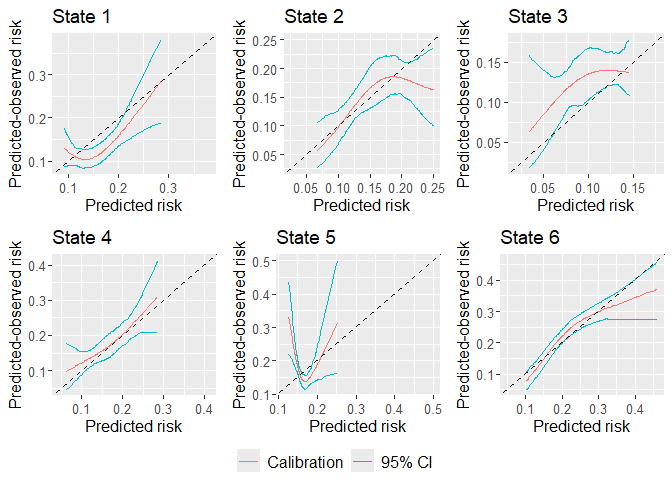
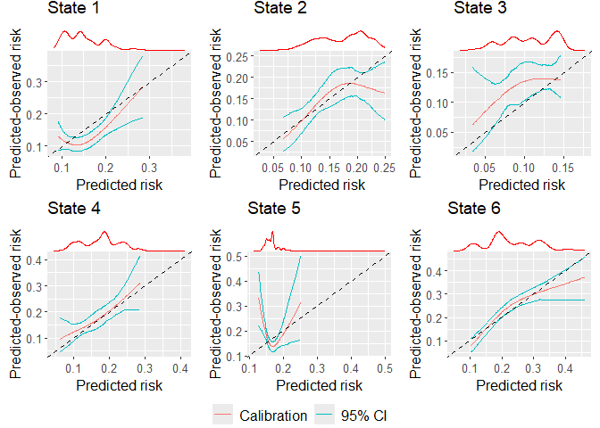

<!-- README.md is generated from README.Rmd. Please edit that file -->

# calibmsm

<!-- badges: start -->

[](https://github.com/alexpate30/calibmsm/actions/workflows/R-CMD-check.yaml)
[](https://app.codecov.io/gh/alexpate30/calibmsm/?branch=master)
[](https://CRAN.R-project.org/package=calibmsm)
[](https://cran.r-project.org/package=calibmsm)

<!-- badges: end -->

The goal of **calibmsm** is to provide a set of tools for estimating
calibration plots when validating an existing (i.e. previously
developed) multistate model. While the vignettes and articles for this
package focus on assessing the calibration of a multistate model,
calibration plots can also be produced for predicted risks from dynamic
models, landmark super models, competing risks models and standard
single outcome survival models, where predictions can be made at any
landmark time.

For a detailed guide on how to use **calibmsm** please see the [Overview
vignette](https://alexpate30.github.io/calibmsm/articles/overview_vignette.pdf).

## Installation

The package can be installed from CRAN as follows:

``` r
install.packages("calibmsm")
```

You can install the development version of calibmsm from
[GitHub](https://github.com/alexpate30/calibmsm) with:

``` r
# install.packages("devtools")
devtools::install_github("alexpate30/calibmsm")
```

## Example

This is a basic example which shows you how to assess the calibration of
the transition probabilities at 5 years follow up for individuals out of
state `j = 1` at time `s = 0` using the BLR-IPCW approach. Please see
the *Overview* vignette for examples of how to assess calibration using
the pseudo-value and MLR-IPCW approaches, as well as details of the
methodology.

The predicted transition probabilities are stored in `tps0`, the
individuals data are stored in `ebmtcal`, and the data in `msdata`
format are stored in `msebmtcal`. Calibration curves are estimated using
`calib_msm` using the BLR-IPCW method (`calib.type = 'blr'`) with
inverse probability of censoring weights are calculated based on
variables `year`, `age`, `prophylaxis` and donor gender `match`. The
calibration curves are estimated using restricted cubic splines with 3
knots. A 95% confidence interval is calculated using bootstrapping with
200 bootstrap replicates.

``` r
## Load calibmsm
library(calibmsm)

## Extract relevant predicted risks from tps0
tp_pred_s0 <- dplyr::select(dplyr::filter(tps0, j == 1), any_of(paste("pstate", 1:6, sep = "")))

## Calculate observed event probabilities
dat_calib_blr <-
  calib_msm(data_ms = msebmtcal,
            data_raw = ebmtcal,
            j = 1,
            s = 0,
            t = 1826,
            tp_pred = tp_pred_s0,
            calib_type = "blr",
            curve_type = "rcs",
            rcs_nk = 3,
            w_covs = c("year", "agecl", "proph", "match"),
            CI = 95,
            CI_R_boot = 200)
```

We can then plot the calibration plots:

``` r
plot(dat_calib_blr, combine = TRUE, nrow = 2, ncol = 3, axis.titles.x = c(4,5,6), axis.titles.y = c(1,4), marg_density = FALSE)
```



If wanting to include marginal density plots (recommended, also the
default) then the output is a gTable, that must then in turn be plotted,
i.e:

``` r
marg_density_plot <- plot(dat_calib_blr, combine = TRUE, nrow = 2, ncol = 3, axis.titles.x = c(4,5,6), axis.titles.y = c(1,4))
plot(marg_density_plot)
```



At this step `plot` can also be replcaed by `grid::grid.draw`.

## Getting help

If you encounter a bug, please file an issue with a minimal reproducible
example on [GitHub](https://github.com/alexpate30/calibmsm).
