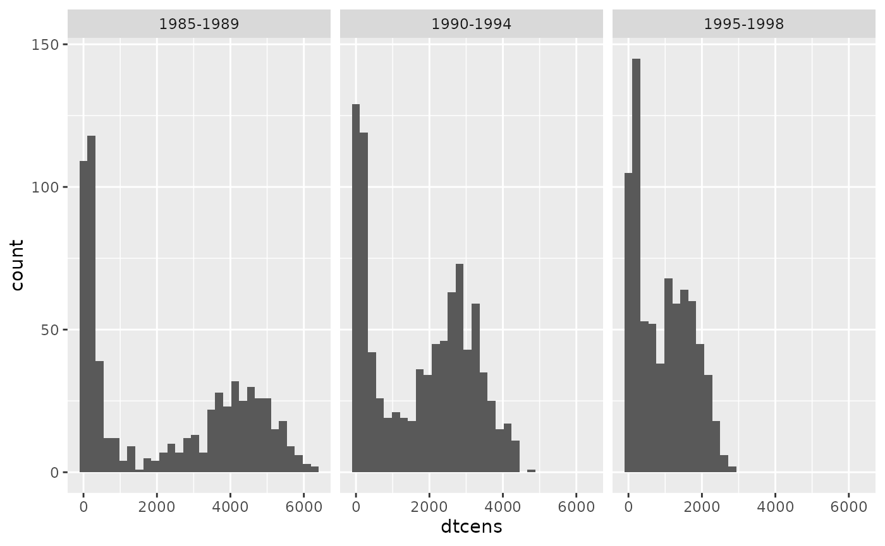
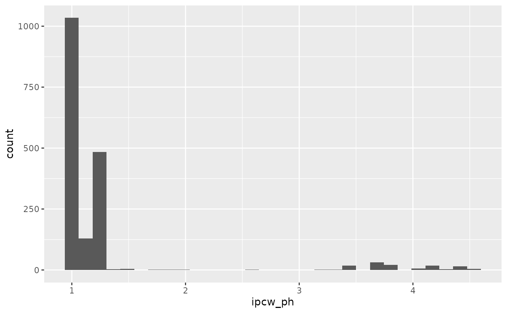
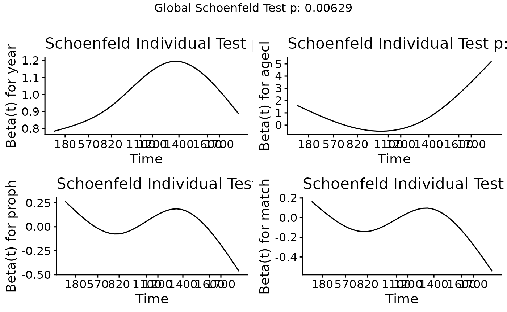

# Sensitivity-analyses-for-IPCWs

## Introduction

This vignette explores the sensitivty of the BLR-IPCW approach to the
estimation of the weights. The start of follow up is the day of the
transplant and the initial state is alive and in remission. There are
three intermediate events ($2$: recovery, $3$: adverse event, or $4$:
recovery + adverse event), and two absorbing states ($5$: relapse and
$6$: death). This data was originally made available from the `mstate`
package (Wreede, Fiocco, and Putter 2011). Please refer to the [Overview
vignette](https://alexpate30.github.io/calibmsm/articles/overview_vignette.pdf)
for a more detailed description of this data.

This analysis is motivated by the fact that in the illustrative example
in the [Overview
vignette](https://alexpate30.github.io/calibmsm/articles/overview_vignette.pdf),
we saw a considerable difference in the estimated calibration curves
from state $j = 1$ into state $k = 3$ when using either BLR-IPCW or
pseudo-value approach. While all the other states show a similar level
of calibration when using either method, which provides reassurance over
their validity, this is not the case for state 3, and further
investigation is required. One hypothesis for this difference is that a
cox-proportional hazards model was used to estimate the weights when
implemtning the BLR-IPCW approach, and it’s possible the proportional
hazards assumption does not hold. We will therefore explore the validity
of this assumption, and re-estimate the calibration curves using a
flexible parametric survival model to estimate the weights.(Royston and
Parmar 2002)

## Exploring the assumption of proportional hazards in the model for estimating the IPCWs

A key variable which predicts the censoring mechanism is year of
transplant, `year`. Individuals who had their transplant more recently
have a shorter administrative censoring time, given they have a shorter
maximum follow up. We can view this by looking at the distribution of
maximum follow up time for each individual (this is the time until
either censoring, or entering an absorbing state $5$ or $6$) stratified
by `year`.

Load libraries and functions:

``` r
set.seed(101)

library(calibmsm)
library(ggplot2)
library(dplyr)
```

    ## 
    ## Attaching package: 'dplyr'

    ## The following objects are masked from 'package:stats':
    ## 
    ##     filter, lag

    ## The following objects are masked from 'package:base':
    ## 
    ##     intersect, setdiff, setequal, union

``` r
library(survival)
requireNamespace("survminer", quietly = TRUE)
library(survminer)
```

    ## Loading required package: ggpubr

    ## 
    ## Attaching package: 'survminer'

    ## The following object is masked from 'package:survival':
    ## 
    ##     myeloma

``` r
requireNamespace("flexsurv", quietly = TRUE)
library(flexsurv)
```

Load data:

``` r
data("ebmtcal")
head(ebmtcal)
```

    ##   id  rec rec.s   ae ae.s recae recae.s  rel rel.s  srv srv.s      year agecl
    ## 1  1   22     1  995    0   995       0  995     0  995     0 1995-1998 20-40
    ## 2  2   29     1   12    1    29       1  422     1  579     1 1995-1998 20-40
    ## 3  3 1264     0   27    1  1264       0 1264     0 1264     0 1995-1998 20-40
    ## 4  4   50     1   42    1    50       1   84     1  117     1 1995-1998 20-40
    ## 5  5   22     1 1133    0  1133       0  114     1 1133     0 1995-1998   >40
    ## 6  6   33     1   27    1    33       1 1427     0 1427     0 1995-1998 20-40
    ##   proph              match dtcens dtcens_s
    ## 1    no no gender mismatch    995        1
    ## 2    no no gender mismatch    422        0
    ## 3    no no gender mismatch   1264        1
    ## 4    no    gender mismatch     84        0
    ## 5    no    gender mismatch    114        0
    ## 6    no no gender mismatch   1427        1

``` r
data("msebmtcal")
head(msebmtcal)
```

    ## An object of class 'msdata'
    ## 
    ## Data:
    ##   id from to trans Tstart Tstop time status
    ## 1  1    1  2     1      0    22   22      1
    ## 2  1    1  3     2      0    22   22      0
    ## 3  1    1  5     3      0    22   22      0
    ## 4  1    1  6     4      0    22   22      0
    ## 5  1    2  4     5     22   995  973      0
    ## 6  1    2  5     6     22   995  973      0

``` r
t_eval <- 1826
```

Look at maximum follow up:

``` r
ebmtcal |>
  ggplot(aes(dtcens)) + geom_histogram() + facet_wrap(~year)
```

    ## `stat_bin()` using `bins = 30`. Pick better value `binwidth`.



When fitting a cox proportional hazards model to estimate the weights,
this will clearly violate the proportional hazards assumption given
there is differential follow up in each group. This is why we opted to
censor all individuals at 5-years follow up (1826 days) before fitting
this model. This is specified through the `w_max_follow` argument in
`calib_msm`.

We can calculate the weights here by running the `calc_weights`
function:

``` r
ebmtcal$ipcw_ph <- calc_weights(data_ms = msebmtcal, 
                                data_raw = ebmtcal, 
                                covs = c("year", "agecl", "proph", "match"), 
                                t = t_eval, s = 0, j = 1, 
                                max_follow = t_eval)$ipcw
```

We can view the distribution of these weights:

``` r
ebmtcal |>
  ggplot(aes(ipcw_ph)) + geom_histogram()
```

    ## `stat_bin()` using `bins = 30`. Pick better value `binwidth`.

    ## Warning: Removed 501 rows containing non-finite outside the scale range
    ## (`stat_bin()`).



These weights are estimated by fitting the following model:

``` r
ebmtcal_5y <- mutate(ebmtcal,
                     dtcens_s = case_when(dtcens > 1826 ~ 0,
                                          TRUE ~ dtcens_s),
                     dtcens = case_when(dtcens > 1826 ~ 1826,
                                        TRUE ~ dtcens))

model_ipcw_ph <- survival::coxph(survival::Surv(dtcens, dtcens_s) ~ year + agecl + proph + match, data = ebmtcal_5y)
model_ipcw_ph
```

    ## Call:
    ## survival::coxph(formula = survival::Surv(dtcens, dtcens_s) ~ 
    ##     year + agecl + proph + match, data = ebmtcal_5y)
    ## 
    ##                          coef exp(coef) se(coef)      z        p
    ## year1990-1994         1.23753   3.44710  0.25132  4.924 8.48e-07
    ## year1995-1998         3.21074  24.79734  0.23772 13.506  < 2e-16
    ## agecl20-40           -0.08229   0.92101  0.11159 -0.737    0.461
    ## agecl>40              0.04593   1.04700  0.12506  0.367    0.713
    ## prophyes              0.01612   1.01625  0.11901  0.135    0.892
    ## matchgender mismatch -0.06660   0.93557  0.10722 -0.621    0.534
    ## 
    ## Likelihood ratio test=617.3  on 6 df, p=< 2.2e-16
    ## n= 2279, number of events= 501

Note there is still a very large hazard-ratio for the year 1995-1998
variable, although this is to be expected given the shorter follow up
times.

Testing the proportional hazards assumption, we find this does not hold
for any of the predictor variables, although `year` is no worse than the
other variables.

``` r
phtest <- cox.zph(model_ipcw_ph)
survminer::ggcoxzph(phtest, resid = FALSE, se = FALSE)
```



We can therefore conclude that it is not the `year` variable alone
driving poor estimation of the weights, however, the proportional
hazards assumption does not hold. We will therefore proceed to estimate
the weights using a flexible parametric model and evaluate whether there
are any differences.

## Flexible parametric model for estimating the inverse probability of censoring weights

We start by defining a function which will estimate the weights using a
flexibe parametric survival model(Royston and Parmar 2002) (implemented
in R using **flexsurv**(Jackson 2016)).

``` r
calc_weights_flexsurv <- function(data_ms, data_raw, covs = NULL, t, s, landmark_type = "state", j = NULL, max_weight = 10, stabilised = FALSE, max_follow = NULL, covs_tv = NULL){

  ### Modify everybody to be censored after time t, if a max_follow has been specified
  if(!is.null(max_follow)){

    ### Stop if max follow is smaller than t
    if (max_follow < t){
      stop("Max follow cannot be smaller than t")
    } else {
      data_raw <- dplyr::mutate(data_raw,
                                dtcens_s = dplyr::case_when(dtcens < max_follow + 2 ~ dtcens_s,
                                                            dtcens >= max_follow + 2 ~ 0),
                                dtcens = dplyr::case_when(dtcens < max_follow + 2 ~ dtcens,
                                                          dtcens >= max_follow + 2 ~ max_follow + 2))
    }
  }

  ### Create a new outcome, which is the time until censored from s
  data_raw$dtcens_modified <- data_raw$dtcens - s

  ### Save a copy of data_raw
  data_raw_save <- data_raw

  ### If landmark_type = "state", calculate weights only in individuals in state j at time s
  ### If landmark_type = "all", calculate weights in all uncensored individuals at time s (note that this excludes individuals
  ### who have reached absorbing states, who have been 'censored' from the survival distribution is censoring)
  if (landmark_type == "state"){
    ### Identify individuals who are uncensored in state j at time s
    ids_uncens <- base::subset(data_ms, from == j & Tstart <= s & s < Tstop) |>
      dplyr::select(id) |>
      dplyr::distinct(id) |>
      dplyr::pull(id)

  } else if (landmark_type == "all"){
    ### Identify individuals who are uncensored time s
    ids_uncens <- base::subset(data_ms, Tstart <= s & s < Tstop) |>
      dplyr::select(id) |>
      dplyr::distinct(id) |>
      dplyr::pull(id)

  }

  ### Subset data_ms and data_raw to these individuals
  data_ms <- data_ms |> base::subset(id %in% ids_uncens)
  data_raw <- data_raw |> base::subset(id %in% ids_uncens)

  ### Assign degree of freedom for baseline hazard
  baseline_df <- 3
  
  ### Create formula for flexible parametric model
  form <- as.formula(paste("survival::Surv(",
                           "dtcens_modified",
                           ",",
                           "dtcens_s",
                           ") ~",
                           paste(unlist(covs), collapse = "+")))
  if(is.null(covs_tv)) {
    cens_model <- flexsurv::flexsurvspline(
      formula = form,
      data = data_raw,
      k = baseline_df,
      scale = "hazard"
    )
  } else {

    covs_tv_list <- vector("list", length = baseline_df+1)
    names(covs_tv_list) <- paste("gamma", 1:(baseline_df+1), sep = "")
    covs_tv_list[paste("gamma",
                   1:(baseline_df+1),
                   sep = "")] <- paste("~",
                                       paste(unlist(covs_tv),
                                             collapse = "+"))

    cens_model <- flexsurv::flexsurvspline(
      formula = form,
      anc = lapply(covs_tv_list, as.formula),
      data = data_raw,
      k = baseline_df,
      scale = "hazard"
    )
  }

  ### Identify individuals who entered absorbing states or were censored prior to evaluation time
  obs_absorbed_prior <- which(data_raw_save$dtcens <= t & data_raw_save$dtcens_s == 0)
  obs_censored_prior <- which(data_raw_save$dtcens <= t & data_raw_save$dtcens_s == 1)

  ###
  ### Now create unstabilised probability of (un)censoring weights
  ### Note that weights are the probability of being uncensored, so if an individual has low probability of being uncesored,
  ### the inervse of this will be big, weighting them strongly
  ###

  ### First etsimate all individuals a weight of the probability of being uncensored at time t
  data_raw_save$pcw <- as.numeric(predict(cens_model, newdata = data_raw_save, type = "surv", times = t - s)$.pred_survival)

  ### Now we must estimate survival probabilities at the times individuals entered absorbing states prior to t (t - s for landmarking)
  ### Identify who these individuals are
  data_raw_absorbed_prior <- data_raw_save[obs_absorbed_prior, ]

  ### Estimate survival probability at time t (t - s for landmarking)
  data_raw_save$pcw[obs_absorbed_prior] <- unlist(lapply(1:nrow(data_raw_absorbed_prior),
                                                         function(x) {dplyr::pull(predict(cens_model,
                                                                                          newdata = data_raw_absorbed_prior[x, ],
                                                                                          times = as.numeric(data_raw_absorbed_prior[x, "dtcens_modified"]),
                                                                                          type = "survival"),
                                                                                  .pred_survival)}
  ))

  ### For individuals who were censored prior to t, assign the weight as NA
  data_raw_save$pcw[obs_censored_prior] <- NA

  ### Invert these
  data_raw_save$ipcw <- 1/data_raw_save$pcw

  ### Create output object
    data_raw_save$ipcw <- pmin(data_raw_save$ipcw, max_weight)
    output_weights <- data.frame("id" = data_raw_save$id, "ipcw" = data_raw_save$ipcw)

  return(output_weights)

}
```

We then use this function to calculate the weights:

``` r
ebmtcal$ipcw_fp <- calc_weights_flexsurv(data_ms = msebmtcal, 
                                data_raw = ebmtcal, 
                                covs = c("year", "agecl", "proph", "match"), 
                                t = t_eval, s = 0, j = 1, 
                                max_follow = t_eval)$ipcw
```

We can view the distribution of these weights:

``` r
ebmtcal |>
  ggplot(aes(ipcw_fp)) + geom_histogram()
```

    ## `stat_bin()` using `bins = 30`. Pick better value `binwidth`.

    ## Warning: Removed 501 rows containing non-finite outside the scale range
    ## (`stat_bin()`).


We see there is very little difference compared to when the weights were
estimated using the cox-proportional hazards model.

Next we use this function to estimate the calibration curves. This is
implemented as the input to argument `w_function` in `calib_msm`. The
function `calc_weights_flexsurv` also has an extra argument (`covs_tv`)
compared to the default function for estimating the weights
(`calc_weights`). This variable is used to specify the variables which
are modelled as time-varying coefficients (time-varying hazard ratio),
wherein the coefficient is modelled as a spline term (function uses 3
degrees of freedom) as described in Royston and Parmar (2002). This
variable should also be specified when running `calib_msm`. For
comparison, we plot the calibration curves using the default internal
approach (cox proportional hazards). First estimate the calibration
curves:

``` r
### Define predicted transition probabilities out of state j = 1 at time s = 0
tp_pred_s0 <- tps0 |>
  dplyr::filter(j == 1) |>
  dplyr::select(any_of(paste("pstate", 1:6, sep = "")))

### Estimate calibration curves

# Default, coxph function for estimating the weights
dat_calib_blr_coxph <-
  calib_msm(data_ms = msebmtcal,
            data_raw = ebmtcal,
            j=1,
            s=0,
            t = t_eval,
            tp_pred = tp_pred_s0,
            calib_type = "blr",
            curve_type = "rcs",
            rcs_nk = 3,
            w_covs = c("year", "agecl", "proph", "match"),
            w_max_follow = 1826)

# Using flexible parametric function for estimating the weights
dat_calib_blr_flexsurv <-
  calib_msm(data_ms = msebmtcal,
            data_raw = ebmtcal,
            j=1,
            s=0,
            t = t_eval,
            tp_pred = tp_pred_s0,
            calib_type = "blr",
            curve_type = "rcs",
            rcs_nk = 3,
            w_covs = c("year", "agecl", "proph", "match"),
            w_function = calc_weights_flexsurv,
            w_max_follow = 1826,
            covs_tv = list("year"))
```

Plot the calibration curves:

``` r
grid::grid.draw(plot(dat_calib_blr_coxph))
```

BLR-IPCW calibration curves when using a cox proportional hazards model
to estimate the weights


``` r
grid::grid.draw(plot(dat_calib_blr_flexsurv))
```

BLR-IPCW calibration curves when using a flexible parametric model to
estimate the weights


There is very little difference, and the estimated calibration curves
are not very sensitive to the choice of model to estimate the inverse
probability of censoring weights. The difference between the BLR-IPCW
and pseudo-calibration curves is therefore unlikely to be driven by
this. We therefore turn our attention to the assumption that the outcome
and censoring distributions are conditionally independent given the
weights.

## Conditional independence of the censoring mechanism and the outcome process

BLR-IPCW and MLR-IPCW approaches assume that the outcome, $I_{k}(t)$, is
independent from the censoring mechanism in the re-weighted population.
This can be thought of as conditional independence between the outcome
and censoring mechanism given the weights. We will explore this
assumption with a number of steps.

### Exploration of the rate of censoring out of each state

We start by looking at all individuals that pass through states 1, 2, 3
and 4, and see what proportion of individuals remain in these states
until they are censored:

``` r
ebmtcal |>
  summarise(
    n = n(),
    prop.cens = mean(as.numeric(ae.s == 0 & rec.s == 0 & recae.s == 0 & srv.s == 0 & rel.s == 0)))
```

    ##      n prop.cens
    ## 1 2279 0.1456779

``` r
ebmtcal |>
  filter(rec.s == 1) |>
  summarise(
    n = n(),
    prop.cens = mean(as.numeric(recae.s == 0 & srv.s == 0 & rel.s == 0)))
```

    ##      n prop.cens
    ## 1 1218 0.3341544

``` r
ebmtcal |>
  filter(ae.s == 1) |>
  summarise(
    n = n(),
    prop.cens = mean(as.numeric(recae.s == 0 & srv.s == 0 & rel.s == 0)))
```

    ##      n prop.cens
    ## 1 1134 0.1948854

``` r
ebmtcal |>
  filter(recae.s == 1) |>
  summarise(
    n = n(),
    prop.cens = mean(as.numeric(srv.s == 0 & rel.s == 0)))
```

    ##     n prop.cens
    ## 1 660  0.630303

We see far fewer individuals remain in the adverse event state (19%)
until they are censored compared to the other states (33.4% and 63.3%).
However, it’s difficult to interpret these, as censoring is heavily
impacted by the competing risks of other events.

A more information measure is to look at the proportion of individuals
that are censored in each state, that are censored within 5-years.

``` r
ebmtcal |>
  filter(ae.s == 0 & rec.s == 0 & recae.s == 0 & srv.s == 0 & rel.s == 0) |>
  summarise(n = n(), mean.fup = mean(dtcens),
            mean.fup.lower.1826 = mean(dtcens < 1826))
```

    ##     n mean.fup mean.fup.lower.1826
    ## 1 332 2392.286           0.3795181

``` r
ebmtcal |>
  filter(rec.s == 1 & recae.s == 0 & srv.s == 0 & rel.s == 0) |>
  summarise(n = n(), mean.fup = mean(dtcens),
            mean.fup.lower.1826 = mean(dtcens < 1826))
```

    ##     n mean.fup mean.fup.lower.1826
    ## 1 407 2259.007           0.4152334

``` r
ebmtcal |>
  filter(ae.s == 1 & recae.s == 0 & srv.s == 0 & rel.s == 0) |>
  summarise(n = n(), mean.fup = mean(dtcens),
            mean.fup.lower.1826 = mean(dtcens < 1826))
```

    ##     n mean.fup mean.fup.lower.1826
    ## 1 221 3082.977           0.1764706

``` r
ebmtcal |>
  filter(recae.s == 1 & srv.s == 0 & rel.s == 0) |>
  summarise(n = n(), mean.fup = mean(dtcens),
            mean.fup.lower.1826 = mean(dtcens < 1826))
```

    ##     n mean.fup mean.fup.lower.1826
    ## 1 416 2366.279           0.3894231

We see that of individuals that are censored in states 1, 2 and 4, about
40% of these are censored prior to 5-years. However, for individuals
that are censored in the adverse event state (state 3), only 17.6% of
these are censored within 5-years. So in the data, we are seeing that
individuals that remain in the adverse event state, are less likely to
be censored. While we cannot fully understand the data observation
process, it is not a stretch to imagine individuals who had had an
adverse event, and not recovered, would be monitored for longer periods
of time, resulting in fewer being censored within 5-years.

### Is this differential censoring driven by differences in baseline predictors?

At this point, we should consider the possibility that year was highly
predictive of adverse event, and we know that year is highly predictive
of follow up time too. In this case, the relationship would be explained
by a variable available at baseline, however, we see that adverse events
are quite similar across different year categories:

``` r
ebmtcal |> group_by(year) |> summarise(mean(ae.s))
```

    ## # A tibble: 3 × 2
    ##   year      `mean(ae.s)`
    ##   <fct>            <dbl>
    ## 1 1985-1989        0.475
    ## 2 1990-1994        0.522
    ## 3 1995-1998        0.487

We also look at the distribution of the other variables across those who
do and do not have an adverse event.

``` r
ebmtcal |> group_by(agecl) |> summarise(mean(ae.s))
```

    ## # A tibble: 3 × 2
    ##   agecl `mean(ae.s)`
    ##   <fct>        <dbl>
    ## 1 <=20         0.445
    ## 2 20-40        0.514
    ## 3 >40          0.517

``` r
ebmtcal |> group_by(proph) |> summarise(mean(ae.s))
```

    ## # A tibble: 2 × 2
    ##   proph `mean(ae.s)`
    ##   <fct>        <dbl>
    ## 1 no           0.520
    ## 2 yes          0.428

``` r
ebmtcal |> group_by(match) |> summarise(mean(ae.s))
```

    ## # A tibble: 2 × 2
    ##   match              `mean(ae.s)`
    ##   <fct>                     <dbl>
    ## 1 no gender mismatch        0.499
    ## 2 gender mismatch           0.492

It is therefore looking like this cannot be explained by information
available at baseline.

### Distribution of weights by outcome state at 5-years

If individuals in state 3 are less likely to be censored than those in
states 1, 2 and 4, then individuals who have spent a long time in state
3 do not need to be upweighted as much. Using the inverse probability of
censoring weights estimated earlier, we take the mean weight, grouped by
the outcome state individuals are in at 5-years.

We start by identifying which state each individual is in at 5-years.

``` r
### Extract which state individuals are in at time t
ids_state_list <- vector("list", 6)
for (k in 1:6){
  ids_state_list[[k]] <- calibmsm:::extract_ids_states(msebmtcal, tmat = attributes(msebmtcal)$trans, k, t_eval)
}

### Create a variable to say which state an individual was in at the time of interest
## Create list containing the relevant data
v1 <- ebmtcal$id
m1 <- outer(v1, ids_state_list, FUN = Vectorize('%in%'))
state_poly <- lapply(split(m1, row(m1)), function(x) (1:6)[x])

## Change integer(0) values to NA's
idx <- !sapply(state_poly, length)
state_poly[idx] <- NA

## Add to ebmtcal
ebmtcal <- dplyr::mutate(ebmtcal, state_poly = unlist(state_poly),
                          state_poly_fac = factor(state_poly))
```

Then calculate mean weight within each group:

``` r
ebmtcal |> group_by(state_poly) |> summarise(mean_weight = mean(ipcw_ph))
```

    ## # A tibble: 7 × 2
    ##   state_poly mean_weight
    ##        <int>       <dbl>
    ## 1          1        1.32
    ## 2          2        1.52
    ## 3          3        1.47
    ## 4          4        1.64
    ## 5          5        1.05
    ## 6          6        1.03
    ## 7         NA       NA

Given the differential rate of censoring within 5-years (17% vs 40%), we
would require weights for individuals in state 3 at 5-years to be
considerably lower than for states 1, 2 and 4. Note that this is only a
proxy, as individuals in state 4 may have spent some time in state 3,
however, we would expect bigger differences than what is observed here.
It is therefore likely that the inverse probability of censoring weights
are incorrect, however, not due to a violation of the proportional
hazards assumption as previously thought.

The BLR-IPCW and MLR-IPCW approaches assume conditional independence
between the outcome and censoring distribution given the weights. This
is the underlying assumption upon which inverse probability of censoring
is based. So far, we have proposed estimating the weights conditional on
a vector of covariates collected at baseline, Z. When the weights are
estimated by modelling the time until censoring conditional on a vector
of baseline covariates **Z**, this effectively becomes conditional
independence given (a function of) **Z**. Indeed, if this assumption
holds, the proposed methodology works fine, as was shown trough
simulations.(Pate et al. 2024) However, something that has not been
considered is when the censoring mechanism changes depending on which
state an individual is in. In this setting, conditional dependence
between the outcome and the censoring mechanism given weights estimated
from baseline covariates alone may be hard to achieve, unless the
baseline covariates are highly predictive of the states upon which
individuals will enter. We believe this is likely happening in this
setting. It’s possible this could be mitigated by using more complex
models to estimate the IPCWs, such as a latent class model, where the
probability of censoring is dependent on the outcome state that an
individual is in. However, much deeper thought is required around this
notion, and simulation studies would be required to establish the
performance of such an approach. Note that when the probability of
censoring changes depending on the outcome state an individual is
present in, we do not believe this will violate the assumption of the
Aalen-Johansen estimator, which require “subjects who are censored at
time t should be representative of all the study subjects who remained
at risk at time t with respect to their survival experience”.(Kleinbaum
and Klein 2012). However, again, it would be beneficial to establish
this through a simulation study.

For now, we would like to emphasise to users that in order to implement
the BLR-IPCW and MLR-IPCW approaches, it is essential for the outcome
and censoring mechanism to be conditionally independent given some set
of baseline covariates $\mathbf{Z}$, whether this is via the weighting
in IPCW, or the grouping in the pseudo-value approach. If the censoring
probability, or observation process, changes depending on the outcome
state that an individuals is in, this can cause bias in the estimation
of the calibration curves unless properly accounted for when estimating
the weights.

Jackson, Christopher H. 2016. “Flexsurv: A platform for parametric
survival modeling in R.” *Journal of Statistical Software* 70 (8).
<https://doi.org/10.18637/jss.v070.i08>.

Kleinbaum, David G., and Mitchel Klein. 2012. *Survival Analysis: A
Self-Learning Text*. 3rd ed. Springer.
<https://doi.org/10.1007/978-1-4419-6646-9>.

Pate, Alexander, Matthew Sperrin, Richard D. Riley, Niels Peek, Tjeerd
Van Staa, Jamie C. Sergeant, Mamas A. Mamas, et al. 2024. “Calibration
plots for multistate risk predictions models.” *Statistics in Medicine*,
no. April: 1–23. <https://doi.org/10.1002/sim.10094>.

Royston, Patrick, and Mahesh K. B. Parmar. 2002. “Flexible parametric
proportional-hazards and proportional-odds models for censored survival
data, with application to prognostic modelling and estimation of
treatment effects.” *Statistics in Medicine* 21 (15): 2175–97.
<https://doi.org/10.1002/sim.1203>.

Wreede, Liesbeth C de, Marta Fiocco, and Hein Putter. 2011. “mstate: An
R Package for the Analysis of Competing Risks and Multi-State Models.”
*Journal of Statistical Software* 38 (7).
<https://cran.r-project.org/package=mstate>.
